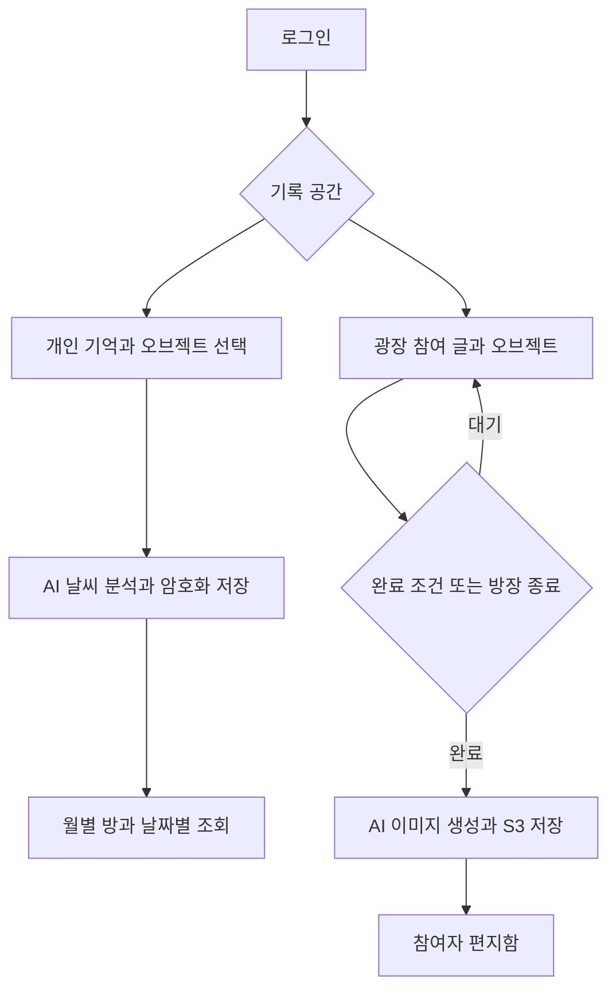
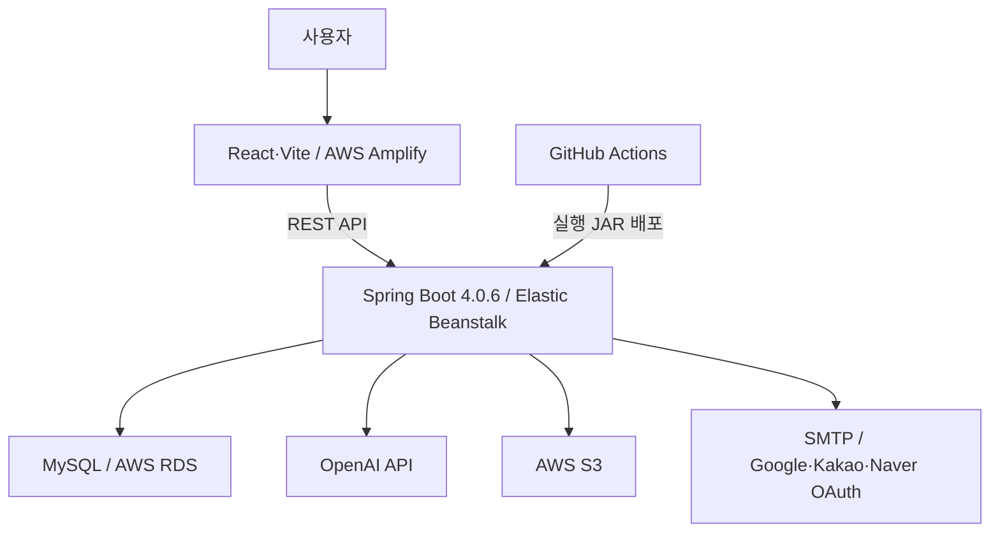
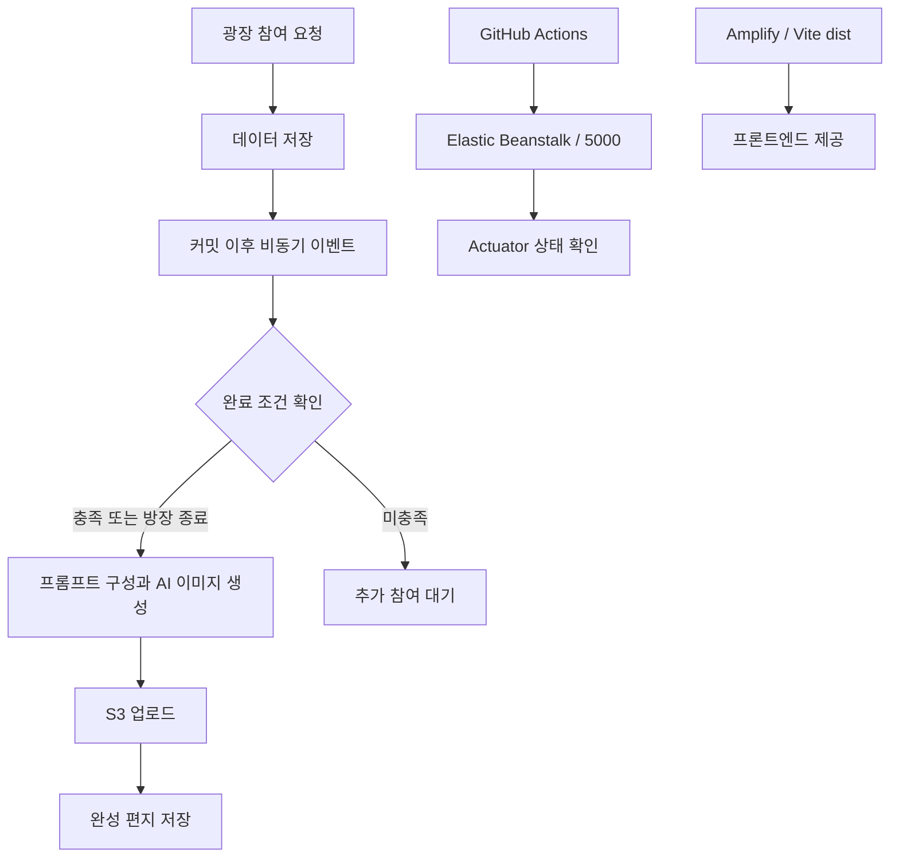
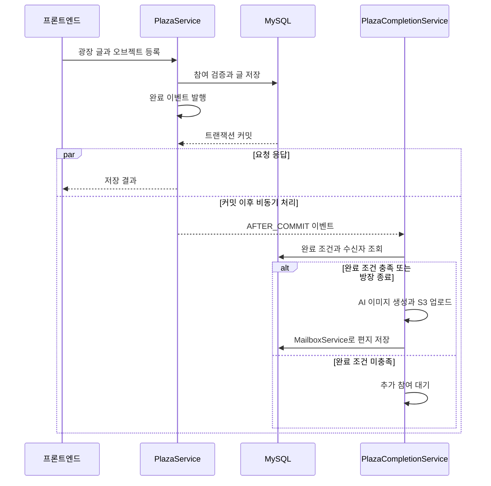
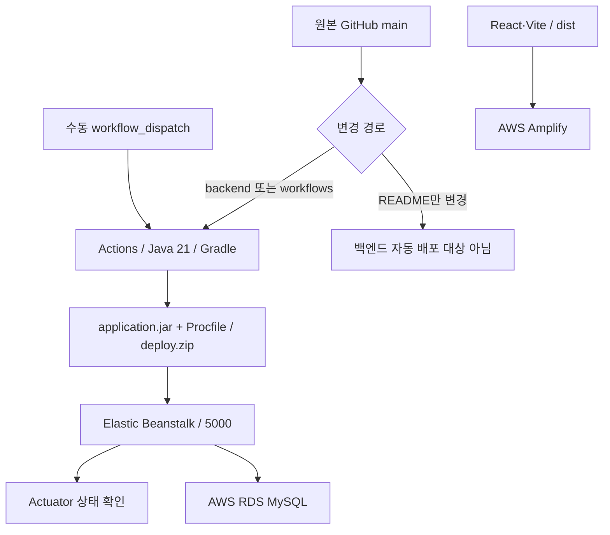

# 마음의 날씨

> 말하지 못한 감정을 기록하면 AI가 글의 정서에 어울리는 날씨를 추천하고, 사용자가 고른 오브젝트로 기억을 남기는 감정 기록·공유 서비스입니다. 광장에서는 여러 사람의 기록을 한 장의 AI 이미지로 완성해 편지함에 전달합니다.

> [!NOTE]
> 이 저장소는 4인 팀 프로젝트에서 김준영이 담당한 백엔드 개발과 AWS 배포 기여를 정리한 **문서형 포트폴리오**입니다. 전체 소스 코드는 [원본 팀 저장소](https://github.com/guddlrdl123/WeatherOfTheHeart-)에 있으며, 다른 팀원의 작업을 개인 저장소로 복제하지 않았습니다.

**빠른 탐색** · [실행·배포 안내](docs/RUN_GUIDE.md) · [최신 점검 근거](docs/README_AUDIT.md) · [쉬운 프로젝트 회고](docs/PROJECT_REVIEW.md) · [담당 기능 상세](docs/MY_CONTRIBUTIONS.md) · [시스템·배포 구조](docs/ARCHITECTURE.md) · [전체 ERD](https://github.com/guddlrdl123/WeatherOfTheHeart-/blob/main/docs/db-erd.md) · [수상 증빙](#수상-및-증빙) · [검증 현황과 한계](#검증-현황과-기술적-한계)

**핵심 코드 바로가기** · [광장 완료 처리](https://github.com/guddlrdl123/WeatherOfTheHeart-/blob/main/backend/src/main/java/com/woth/backend/plaza/PlazaCompletionService.java) · [AI 이미지 프롬프트](https://github.com/guddlrdl123/WeatherOfTheHeart-/blob/main/backend/src/main/java/com/woth/backend/plaza/PlazaImagePromptBuilder.java) · [S3 이미지 저장](https://github.com/guddlrdl123/WeatherOfTheHeart-/blob/main/backend/src/main/java/com/woth/backend/storage/S3ImageStorageService.java) · [백엔드 배포 워크플로](https://github.com/guddlrdl123/WeatherOfTheHeart-/blob/main/.github/workflows/deploy-backend.yml)

## 30초 요약

| 궁금한 점 | 답변 |
| --- | --- |
| 무엇을 만든 프로젝트인가요? | 글의 정서에 맞는 날씨와 선택한 오브젝트로 기억을 시각화하고, 광장 참여 기록을 한 장의 AI 이미지로 완성하는 서비스입니다. |
| 무엇을 맡았나요? | Java 백엔드와 광장 완성 기능을 개발하고, 백엔드는 Elastic Beanstalk에, 프론트엔드는 AWS Amplify에 배포했습니다. |
| 가장 중요한 작업은 무엇인가요? | 광장에 기록이 모이면 AI 이미지를 만들고, S3에 보관한 뒤 참여자의 편지함으로 보내는 흐름을 구현했습니다. |
| 어떤 결과가 있었나요? | 4인 팀으로 프로젝트를 완성했고, SW 잡브릿지-DAY 통합프로젝트 발표회에서 우수상을 받았습니다. |
| 지금 서비스를 볼 수 있나요? | 현재 데모 운영은 종료됐습니다. 대신 코드·커밋·구조 문서와 실제 수상 증빙을 공개하고 있습니다. |

## 주요 성과

- 2026년 7월 16일 **SW 잡브릿지-DAY 통합프로젝트 발표회**에서 `마음의 날씨` 프로젝트로 **2026 K-디지털트레이닝 벤처·스타트업 유형 우수상**을 수상했습니다.
- 관련 과정: **고용노동부 K-디지털트레이닝(벤처·스타트업 유형)**
- 주관·수여: **(사)한국경영혁신중소기업협회(MAINBiz)**
- 4인 팀 프로젝트로 기획, 개발, 배포 및 발표를 완료했습니다.
- 김준영은 팀에서 **Java 백엔드 개발, GitHub Actions·YAML·환경변수 구성, Elastic Beanstalk 백엔드 배포와 AWS Amplify 프론트엔드 배포**를 담당했습니다.
- 광장 참여 데이터가 완료 조건을 충족하면 AI 최종 이미지를 생성하고 참여자의 편지함으로 전달하는 흐름을 구현했습니다.

> 수상은 개인 단독 수상이 아닌 4인 팀 프로젝트의 성과입니다.

## 프로젝트 개요

`마음의 날씨`는 글의 정서를 AI가 분석한 날씨와 사용자가 선택한 오브젝트를 함께 보여 주는 서비스입니다.

- **개인 방**: 기억을 작성하고 오브젝트를 선택하면, 백엔드가 AI로 날씨를 분석해 저장합니다. 기록은 월별 개인 방과 날짜별 캘린더에서 돌아봅니다.
- **광장**: 여러 사용자의 감정과 오브젝트가 하나의 공간에 쌓입니다.
- **광장 완성**: 설정된 참여 조건을 충족하거나 방장이 종료하면 참여 데이터를 모아 AI 최종 이미지를 생성합니다.
- **편지함**: 이미지 생성과 저장을 마친 뒤 완성 결과와 참여 당시 기록을 전달합니다. 완료 요청 직후부터 이미지가 즉시 보이는 구조는 아닙니다.

공개 반응 수치를 중심으로 하는 SNS보다, 함께 만든 공간의 분위기와 시각적 표현을 통해 감정을 공유하는 데 초점을 맞췄습니다.

## 프로젝트 정보

| 항목 | 내용 |
| --- | --- |
| 프로젝트명 | 마음의 날씨 (Weather of the Heart) |
| 프로젝트 형태 | 4인 팀 프로젝트 |
| 개발 기간 | 2026.06 |
| 김준영 담당 | Java 백엔드 개발, 광장 핵심 로직, AI 이미지 생성 연동, AWS 이미지 저장, GitHub Actions·YAML·환경변수 구성, Elastic Beanstalk 백엔드 배포, AWS Amplify 프론트엔드 배포 |
| 수상 내역 | SW 잡브릿지-DAY 통합프로젝트 발표회, 2026 K-디지털트레이닝 벤처·스타트업 유형 우수상 (고용노동부 관련 과정, 한국경영혁신중소기업협회 주관·수여, 2026.07.16) |
| Frontend | React 19, TypeScript, Vite, React Router, Tailwind CSS |
| Backend | Java 21, **Spring Boot 4.0.6**, Spring Web MVC, Spring Data JPA, Actuator |
| Database | MySQL, AWS RDS for MySQL(운영 구성) |
| AI | OpenAI API + WebClient. LangChain4j OpenAI starter는 빌드 의존성에 선언 |
| Infrastructure | AWS Elastic Beanstalk, AWS Amplify, AWS S3, AWS RDS |
| CI/CD | GitHub Actions, Gradle |
| 협업 도구 | Git, GitHub |

## 기획 배경과 해결하려는 문제

감정 기록은 꾸준히 이어가기 어렵고, 텍스트만 쌓이면 과거의 분위기를 직관적으로 되짚기 어렵습니다. 반대로 일반 SNS는 공개 반응과 비교에 초점이 맞춰져 있어 말하기 어려운 감정을 편안하게 남기기에는 부담이 될 수 있습니다.

이 프로젝트는 다음 방식으로 문제를 풀었습니다.

1. AI가 사용자가 작성한 글의 정서를 분석해 날씨 키·이름·확신도·선정 이유를 반환합니다.
2. 개인 기록을 오브젝트와 날씨가 있는 방으로 시각화합니다.
3. 광장에서는 여러 사용자의 기록을 하나의 공간에 축적합니다.
4. 광장이 완료되면 참여 데이터를 하나의 이미지로 재해석해 공동 결과물로 남깁니다.
5. 완성 결과를 참여자의 편지함으로 전달해 기록을 다시 확인할 수 있게 합니다.

## 주요 사용자 흐름



## 주요 기능

| 영역 | 기능 |
| --- | --- |
| 인증 | 이메일 회원가입·인증, 로그인, 비밀번호 재설정, Google·Kakao·Naver 소셜 로그인 |
| 개인 방 | 기억 작성·조회·수정·삭제, AI 날씨 분석, 오브젝트 선택·배치, 날짜별 조회 |
| 데이터 보호 | 개인 기억 제목·본문의 AES-256-GCM 암호화 저장 |
| 광장 | 광장 생성·입장, 글 작성·수정·삭제, 위치 저장, 좋아요, 신고, 완료 처리 |
| AI 결과 | 광장 감정·오브젝트 수집, 프롬프트 생성, 최종 이미지 생성, S3 저장 |
| 편지함 | 광장 완성 결과 전달, 읽음 상태, 전체 읽음, 편지 삭제, 이미지 다운로드 |
| 사용자 | 마이페이지, 프로필 수정, 활동 내역, 회원 탈퇴 |
| 운영 | 공지사항, 1:1 문의, 신고 내역 확인, 글 블라인드, 경고, 사용자 정지 |

개인 기억의 제목·본문은 JPA 변환기를 통해 **AES-256-GCM**으로 암호화되어 저장됩니다. 키는 Base64로 인코딩한 32바이트 값이며, 암호화마다 새로운 12바이트 IV를 사용합니다. 이 보호 범위는 DB에 저장되는 개인 기억의 제목·본문입니다. AI 분석 과정에서는 백엔드가 입력 글을 OpenAI API로 전송합니다.

AES-256-GCM 암호화는 [원본 커밋 `4aa2082`](https://github.com/guddlrdl123/WeatherOfTheHeart-/commit/4aa2082c4cef9d95d65c09c8017cbc188b1db9fc)에서 확인되는 **프로젝트 전체 기능**입니다. 기록된 작성자가 `guddlrdl123`이므로 김준영의 직접 구현으로 표시하지 않았습니다.

## 전체 시스템 구조



## 구성 요소별 역할

| 구성 요소 | 역할 |
| --- | --- |
| React Frontend | 개인 방·광장·편지함·관리 화면과 사용자 상호작용 처리 |
| Spring Boot Backend | 인증, 기억, 광장, AI 연동, 편지함, 관리자 도메인의 REST API와 비즈니스 로직 처리 |
| MySQL / AWS RDS | 사용자, 기억, 광장, 참여 글, 편지 데이터 저장 |
| OpenAI API | 감정 분석 및 광장 최종 이미지 생성 |
| AWS S3 | AI 결과 이미지와 서비스 이미지의 영속 저장 |
| AWS Elastic Beanstalk | Spring Boot 백엔드 운영 환경 |
| AWS Amplify | React 프론트엔드 운영 배포 환경 |
| GitHub Actions | main 브랜치의 백엔드 변경을 빌드하고 Elastic Beanstalk에 배포 |
| SMTP / OAuth 제공자 | 이메일 인증·재설정 메일과 소셜 로그인 처리 |

## 팀 구성과 역할

4명이 함께 기획, 프론트엔드, 백엔드, 배포와 발표를 수행했습니다. 원본 저장소에서 팀원별 세부 역할을 모두 확정할 수 없어 이름별 역할은 임의로 작성하지 않았습니다.

| 구분 | 역할 |
| --- | --- |
| 팀 전체 | 서비스 기획, 기능 개발, 통합, 배포, 발표 |
| 김준영 | Java 백엔드 개발, 광장 핵심 로직, AI 이미지 생성 연동, AWS 이미지 저장, GitHub Actions·YAML·환경변수 구성, Elastic Beanstalk 백엔드 배포, AWS Amplify 프론트엔드 배포 및 운영 오류 대응 |

## 김준영의 담당 영역



- Java 백엔드 개발
- 광장 참여 데이터와 완료 조건 처리
- 트랜잭션 커밋 이후 비동기 완료 이벤트 처리
- 광장 데이터 기반 AI 최종 이미지 프롬프트 구성
- AI 결과 이미지의 AWS S3 저장 연동
- GitHub Actions 워크플로, 애플리케이션 YAML과 환경변수 구성
- GitHub Actions 기반 Elastic Beanstalk 자동 배포
- AWS Amplify 기반 프론트엔드 배포
- 서버 포트와 헬스 체크 구성, 배포 오류 대응

프론트엔드 **기능 개발**은 김준영의 직접 담당으로 표시하지 않았습니다. 다만 AWS Amplify를 이용한 프론트엔드 **배포**는 사용자 제공 정보에 따라 김준영 담당으로 구분했습니다.

## 김준영이 직접 구현한 기능

| 기능 | 구현 내용 | 코드·커밋 근거 |
| --- | --- | --- |
| 광장 참여 데이터 모델 | `PlazaEntry`에 사용자, 광장, 감정, 날씨, 오브젝트, 위치·레이어 정보를 저장 | `8d5467f`, `859be55` |
| 광장 JPA 조회 | 광장별 참여 글, 사용자별 참여 글, 중복 참여·오브젝트 검사 메서드 구성 | `6a78c2e`, `eb37a1a` |
| 완료 이벤트 | 참여 글 저장 트랜잭션 이후 완료 여부를 확인하는 이벤트 도입 | `90cb2be` |
| AI 최종 이미지 | 참여 오브젝트·감정·위치를 AI 요청용 프롬프트로 구성 | `0aa3629`, `faf0209` 등 |
| 비동기 완료 처리 | 완료 조건 검사, AI 이미지 생성, 참여자 편지 발송을 요청 흐름과 분리 | `31e75ae` |
| S3 저장 | AWS SDK 의존성, S3 클라이언트와 이미지 저장 서비스, 완료 흐름 연동 | `9701d3c`, `2e23cf1`, `1f39b44` |
| 백엔드 배포 설정과 자동화 | GitHub Actions, 애플리케이션 YAML과 환경변수 구성; Java 21·Gradle 빌드, 배포 ZIP 생성, Elastic Beanstalk 배포 | `6695eed` 이후 배포 커밋 및 사용자 제공 담당 정보 |
| 프론트엔드 배포 | React 프론트엔드를 AWS Amplify에 배포 | 사용자 제공 담당 정보. 전체 Git 이력에는 Amplify 설정 파일이 없음 |
| 헬스 체크 | 서버 포트 5000, Actuator 의존성, `/`·`/health` 응답 구현. 상태 확인 안내는 `/actuator/health` 중심으로 구분 | `098643b`, `624c0fd`, `30d7d38` 및 현재 설정 |

현재 코드에서 프롬프트 입력 오브젝트는 `MAX_OBJECTS_FOR_PROMPT = 30`으로 제한됩니다. 광장 자체의 완료 기준은 각 광장의 `maxObjects` 값이며 엔티티 기본값은 8입니다. 현재 구현에는 `MAIN`·`SUPPORTING` 분류 상수가 없으므로 해당 표현은 사용하지 않았습니다.

더 자세한 근거와 클래스별 처리 흐름은 [김준영 담당 기능 상세](docs/MY_CONTRIBUTIONS.md)에서 확인할 수 있습니다.

## 핵심 기술 구현 과정

### 1. 저장과 외부 AI 작업의 분리

`PlazaService`는 참여 글을 저장한 뒤 `PlazaEntryCreatedEvent`를 발행합니다. `PlazaCompletionService`는 `@TransactionalEventListener(phase = AFTER_COMMIT)`과 `@Async`로 이벤트를 받아, 저장 트랜잭션이 끝난 이후 완료 조건 검사와 외부 AI 호출을 수행합니다.

이 구조는 사용자 요청에서 반드시 성공해야 하는 데이터 저장과 응답 시간이 긴 AI 이미지 생성의 실패 범위를 분리합니다.

### 2. 광장 완료와 중복 실행 제어

완료 서비스는 새 트랜잭션에서 광장과 참여 글을 읽고 `entries.size() >= plaza.maxObjects`인지 확인합니다. 생성 중에는 `imageGenerating` 상태를 확인해 추가 작업을 제한하고, 방장 종료 시에는 `forceComplete` 이벤트로 같은 완료 흐름을 재사용합니다. 상태 확인과 변경은 DB의 원자적 잠금으로 구현되어 있지 않아, 동시 실행을 완전히 막는 보장으로 확대해 설명하지 않습니다.

### 3. AI 프롬프트와 결과 저장

`PlazaImagePromptBuilder`는 참여자의 감정·날씨·오브젝트·좌표를 한 장의 장면을 위한 프롬프트로 변환합니다. 프롬프트 과대화를 막기 위해 최대 30개 항목만 사용하고, 좌표를 상·중·하와 좌·중·우의 대략적인 위치로도 변환합니다.

생성 결과는 data URL을 디코딩해 `plazas/{plazaId}/{UUID}.{ext}` 키로 S3에 업로드하고, 공개 기준 URL을 편지 데이터에 연결합니다. 버킷과 공개 기준 URL은 환경변수로 분리했습니다.

### 4. 배포 자동화

`main` 브랜치에서 `backend/**` 또는 워크플로가 바뀌면 Java 21 Corretto 환경에서 `./gradlew clean build -x test`를 실행합니다. 실행 JAR과 `Procfile`을 ZIP으로 묶고 GitHub Secrets를 사용해 Elastic Beanstalk 애플리케이션 버전으로 배포합니다.

프론트엔드는 AWS Amplify에 배포했습니다. 현재 원본 소스는 React·Vite이며 `npm ci` → `npm run build`로 `frontend/dist`를 생성합니다. Amplify의 재현용 빌드 설정은 `appRoot: frontend`, 산출물 `dist`로 정리했습니다. 당시 콘솔 설정 원본은 저장소에 없으므로, 실제 배포 경험과 재현용 설정 예시는 구분합니다. 프로젝트 종료 후에는 유지 비용을 줄이기 위해 AWS 배포 리소스를 정리했습니다.

구조와 시퀀스 다이어그램은 [시스템 및 배포 구조](docs/ARCHITECTURE.md)에 정리했습니다.

## 문제 해결 경험

### 1. AI 이미지 생성으로 참여 요청이 길어지는 문제

- **문제**: 참여 데이터 저장과 이미지 생성이 한 요청에 묶이면 응답 시간이 긴 외부 API 호출 때문에 사용자가 오래 기다릴 수 있었습니다.
- **원인 분석**: 핵심 데이터 저장과 부가 결과 생성의 처리 시간·실패 조건이 서로 달랐습니다.
- **해결 방법**: 참여 글 저장 후 이벤트를 발행하고, 트랜잭션 커밋 이후 별도 비동기 흐름에서 완료 검사와 이미지 생성을 실행했습니다.
- **결과**: 저장 트랜잭션과 외부 AI 작업의 실패 범위를 분리하고 요청 지연을 줄일 수 있는 구조를 만들었습니다.
- **배운 점**: 외부 API 작업은 핵심 쓰기 트랜잭션과 수명 주기를 분리해야 합니다.

### 2. 재배포 시 이미지가 사라질 수 있는 문제

- **문제**: Elastic Beanstalk 인스턴스의 로컬 디스크는 재배포·교체 시 영속성을 보장하지 않습니다.
- **원인 분석**: 애플리케이션 실행 환경과 사용자가 다시 조회해야 하는 이미지의 수명이 달랐습니다.
- **해결 방법**: AWS SDK for Java를 연결하고 AI 결과 이미지를 S3에 저장한 뒤 URL을 편지 데이터에 연결했습니다.
- **결과**: 백엔드 인스턴스 교체와 이미지 수명을 분리했습니다.
- **배운 점**: 운영 환경에서는 상태를 애플리케이션 인스턴스 밖에 보존해야 합니다.

### 3. 로컬과 AWS 배포 환경의 차이

- **문제**: 로컬에서 실행되던 서버가 Elastic Beanstalk에서는 빌드 산출물, 포트, 환경변수와 외부 리소스 권한 차이 때문에 정상화되지 않을 수 있었습니다.
- **원인 분석**: 배포 ZIP 구조, 실행 명령, 기본 포트, DB 연결, S3 권한과 헬스 체크가 함께 맞아야 했습니다.
- **해결 방법**: 실행 JAR과 `Procfile`을 명시적으로 패키징하고 서버 포트를 5000으로 맞췄으며, 환경별 값을 환경변수로 분리하고 `/`·`/health` 응답을 추가했습니다. 현재 실행 안내에서는 Actuator 상태 확인과 고정 `OK` 응답의 차이를 함께 설명합니다.
- **결과**: 빌드부터 배포·상태 확인까지 반복 가능한 흐름을 구성했습니다.
- **배운 점**: 운영 장애는 코드만이 아니라 패키징, 네트워크, 권한, 설정과 관측 지점을 함께 봐야 합니다.

### 4. 커밋 전 완료 처리가 실행될 수 있는 문제

- **문제**: 비동기 완료 검사가 참여 글 저장 커밋보다 먼저 최신 데이터를 조회하면 완료 조건을 놓칠 수 있었습니다.
- **원인 분석**: 이벤트 발행 시점과 트랜잭션 커밋 시점이 일치하지 않았습니다.
- **해결 방법**: `TransactionPhase.AFTER_COMMIT` 리스너와 별도 `REQUIRES_NEW` 트랜잭션으로 완료 스냅샷을 읽도록 구성했습니다.
- **결과**: 커밋된 참여 데이터를 기준으로 완료 여부를 판단하도록 실행 순서를 보장했습니다.
- **배운 점**: 비동기 이벤트는 어떤 트랜잭션 상태를 관찰해야 하는지 먼저 정의해야 합니다.

## 프로젝트 전체 기술 스택

| 구분 | 기술 |
| --- | --- |
| Frontend | React 19.2.6, TypeScript 6, Vite 8.0.14, React Router 7, Tailwind CSS 3, Lucide React, html-to-image |
| Backend | Java 21, Spring Boot 4.0.6, Spring Web MVC, Spring Data JPA, Validation, Mail, Actuator, WebClient, BCrypt |
| Data | 로컬 MySQL 8.4(`compose.yaml`), 운영 구성 AWS RDS for MySQL, JPA |
| AI | OpenAI `gpt-4.1-mini`(글 분석), `gpt-image-1`(광장 이미지), WebClient. LangChain4j starter 0.31.0은 의존성 선언 |
| Infrastructure | AWS Elastic Beanstalk, AWS Amplify, AWS S3, AWS RDS |
| CI/CD | GitHub Actions, Gradle Wrapper 9.4.1, Procfile |
| Local environment | Docker Compose(MySQL) |

버전은 [원본 `main` 커밋 `40a127e`](https://github.com/guddlrdl123/WeatherOfTheHeart-/commit/40a127ecd8baf8b110a438e9ef1a858a0bf6e77b)의 `build.gradle`, Gradle Wrapper, `package-lock.json`을 기준으로 확인했습니다. 공개 소스와 [2026년 7월 1일 배포 성공 기록](https://github.com/guddlrdl123/WeatherOfTheHeart-/actions/runs/28488782913)의 대상 커밋 모두 Spring Boot **4.0.6**을 선언합니다. RDS의 실제 엔진 버전은 로컬 MySQL 이미지 버전과 구분해 관리합니다.

## 김준영이 직접 사용한 기술

`Java 21` · `Spring Boot` · `Spring Data JPA` · `MySQL` · `Spring Transaction Event` · `@Async` · `OpenAI API` · `WebClient` · `AWS SDK for Java` · `AWS S3` · `AWS Elastic Beanstalk` · `AWS Amplify` · `AWS RDS` · `GitHub Actions` · `Gradle` · `Git`

React 등 프론트엔드 기능 개발 기술은 프로젝트 전체 기술에 포함했지만 김준영의 직접 개발 기술로 표시하지 않았습니다. AWS Amplify 프론트엔드 배포는 직접 담당 범위에 포함했습니다.

## 데이터 및 요청 처리 흐름



## 배포 구조



백엔드는 원본 워크플로에서 빌드·ZIP 생성·Elastic Beanstalk 배포를 확인할 수 있습니다. 가장 최근에 확인 가능한 [배포 실행 #28488782913](https://github.com/guddlrdl123/WeatherOfTheHeart-/actions/runs/28488782913)은 **2026년 7월 1일**에 빌드와 배포 단계 모두 성공했으며, 대상 커밋은 [`7ec6142`](https://github.com/guddlrdl123/WeatherOfTheHeart-/commit/7ec61429f6b6e4e92933e39f67df6ec8a58ecba4)입니다. 배포 빌드는 `-x test`로 테스트를 제외합니다.

프론트엔드 배포 경험은 기존 담당 기록을 유지하고, 재현 시에는 현재 Vite 소스에 맞는 `dist` 산출물과 React Router 주소 재작성을 사용합니다. 당시 AWS 콘솔 설정이나 로드밸런서에 등록된 상태 확인 경로는 저장소만으로 확정하지 않습니다. [실행·배포 안내](docs/RUN_GUIDE.md)에 환경변수, 빌드 설정과 확인 방법을 정리했습니다.

프로젝트 종료 후 유지 비용을 줄이기 위해 AWS 배포 리소스를 정리했으므로 현재 상태는 **데모 운영 종료**로 표시합니다.

## 실행 방법과 상태 확인

이 저장소는 문서형 포트폴리오입니다. 애플리케이션을 실행할 때는 [원본 팀 저장소](https://github.com/guddlrdl123/WeatherOfTheHeart-)를 내려받습니다.

```bash
git clone https://github.com/guddlrdl123/WeatherOfTheHeart-.git
cd WeatherOfTheHeart-
```

Java 21, Node.js 22.12 이상, Docker Compose를 준비한 뒤 루트 `.env`를 작성하고 로컬 MySQL → 백엔드 → 프론트엔드 순서로 실행합니다. Windows PowerShell 명령, AES 키 생성, 기능별 필수 설정과 주요 API는 [실행·배포 안내](docs/RUN_GUIDE.md)에 모두 정리했습니다.

| 경로 | 확인 내용 | 현재 근거 |
| --- | --- | --- |
| `GET /actuator/health` | Actuator가 자동 등록한 DB·메일 등의 상태를 종합한 결과. 정상일 때 `{"status":"UP"}` | Actuator 의존성과 기본 경로. 실제 응답은 실행 환경에서 확인 |
| `GET /health` | HTTP 200과 고정 문자열 `OK` | `HealthCheckController` 직접 구현 |
| `GET /` | HTTP 200과 고정 문자열 `OK` | 같은 컨트롤러의 루트 응답 |

```powershell
Invoke-RestMethod http://localhost:5000/actuator/health
```

`/actuator/health`도 OpenAI·S3와 전체 서비스 기능을 자동으로 검증하는 것은 아닙니다. 로드밸런서 상태 확인 경로를 지정할 때는 실행 중인 서버의 응답 코드와 검사 범위를 함께 확인합니다.

## 검증 현황과 기술적 한계

**기술 설정 재확인일: 2026년 10월 1일.** 원본 `main` 커밋 `40a127e`의 코드·설정과 GitHub Actions 기록을 대조했습니다. 이번 점검은 문서와 소스의 대조이며, 애플리케이션 테스트나 AWS 서비스 재배포는 수행하지 않았습니다. 세부 근거는 [README 점검 기록](docs/README_AUDIT.md)에 남겼습니다.

| 항목 | 확인된 상태 | 한계와 다음 개선 |
| --- | --- | --- |
| 자동 테스트 | [`BackendApplicationTests`](https://github.com/guddlrdl123/WeatherOfTheHeart-/blob/main/backend/src/test/java/com/woth/backend/BackendApplicationTests.java)의 컨텍스트 로드 1건, [`AuthServiceTest`](https://github.com/guddlrdl123/WeatherOfTheHeart-/blob/main/backend/src/test/java/com/woth/backend/auth/AuthServiceTest.java)의 OAuth 재가입 회귀 테스트 1건 | 광장 완료 조건, 중복 실행, S3 실패와 편지 중복 방지 테스트가 추가로 필요 |
| 배포 빌드 | GitHub Actions에서 `./gradlew clean build -x test` 실행 | 배포 전 별도 테스트 작업을 추가하고 통과한 산출물만 배포하도록 개선 필요 |
| 비동기 완료 처리 | `AFTER_COMMIT`과 `@Async`, `imageGenerating` 진행 상태 확인. OpenAI HTTP 요청에는 조건부 재시도 존재 | 완료 작업 자체의 영속 큐·자동 복구와 원자적 중복 방지는 추가 구현 필요 |
| 헬스 체크 | Actuator 의존성으로 `/actuator/health` 사용 가능. `/`, `/health`는 고정 `OK` | 기본 상태 확인과 OpenAI·S3·전체 기능 검증을 구분. 실제 로드밸런서 경로는 AWS 설정 확인 필요 |
| 이미지 접근 | S3 공개 기준 URL과 객체 키를 조합해 결과 URL 생성 | 감정 기록 결과의 공개 범위를 줄이려면 비공개 버킷과 서명 URL 검토 필요 |
| 성능·운영 지표 | 저장 트랜잭션과 외부 AI 작업을 구조적으로 분리 | 응답 시간·성공률·재시도 횟수의 실측 자료가 없어 정량 개선 수치는 주장하지 않음 |
| 데모 | 프로젝트 종료 후 유지 비용 절감을 위해 AWS 배포 리소스를 정리해 데모 운영 종료 | 개인정보를 제거한 화면 캡처와 30~60초 시연 영상 추가 필요 |

## 주요 화면

수상 증빙 이미지는 추가했으며, 서비스 화면은 개인정보 확인 후 추가할 예정입니다.

추가할 파일과 촬영 기준은 [images/README.md](images/README.md)에 정리했습니다.

- 랜딩·개인 방: `images/main.png`, `images/private-room.png`
- 광장 참여·완성: `images/plaza.png`, `images/plaza-result.png`
- 편지함·관리자: `images/mailbox.png`, `images/admin-report.png`
- 수상 증빙: [`images/award.jpg`](images/award.jpg)

아직 없는 서비스 화면은 깨진 이미지가 표시되지 않도록 파일 경로만 안내합니다.

## 주요 커밋

원본 Git 기록에서 `bamkkayo <junyeong2107@gmail.com>` 작성자로 확인되는 63개 커밋을 검토했습니다. 아래는 현재 GitHub 계정 `junyeong2107`의 이전 사용자 이름으로 제공된 `bamkkayo` 명의의 대표 커밋입니다.

| 주제 | 커밋 | 설명 |
| --- | --- | --- |
| 광장 참여 엔티티 | [8d5467f](https://github.com/guddlrdl123/WeatherOfTheHeart-/commit/8d5467fe6c70086af266b41afc9ba099c232a756) | 광장별 사용자 기록과 감정·오브젝트·위치 정보를 저장하는 모델 추가 |
| 광장 JPA 조회 | [eb37a1a](https://github.com/guddlrdl123/WeatherOfTheHeart-/commit/eb37a1ab99d849a7dde68d91e42dd554e99ce3a2) | 광장 참여 글 조회와 사용자 중복 참여 검사 메서드 추가 |
| 완료 이벤트 | [90cb2be](https://github.com/guddlrdl123/WeatherOfTheHeart-/commit/90cb2be9b58229a305c98503acf333329037317c) | 저장 커밋 이후 완료 여부를 확인하는 이벤트 추가 |
| AI 프롬프트 | [0aa3629](https://github.com/guddlrdl123/WeatherOfTheHeart-/commit/0aa36292477c776b455e74a57a92fb9a875e92a6) | 광장 오브젝트와 감정을 최종 이미지 프롬프트로 구성 |
| 비동기 완료 처리 | [31e75ae](https://github.com/guddlrdl123/WeatherOfTheHeart-/commit/31e75ae2b16eb22a966e8bd8ffa33ed6919d8932) | 완료 조건, AI 이미지 생성과 참여자 편지 발송 흐름 구현 |
| Elastic Beanstalk 배포 | [6695eed](https://github.com/guddlrdl123/WeatherOfTheHeart-/commit/6695eed8084033ac4d012ce77f4d21c1d7188b54) | GitHub Actions 백엔드 배포 워크플로 추가 |
| S3 저장 서비스 | [2e23cf1](https://github.com/guddlrdl123/WeatherOfTheHeart-/commit/2e23cf18935c7294275b866c177eb4528411068c) | S3 클라이언트 설정과 이미지 저장 서비스 추가 |
| S3 완료 흐름 연동 | [1f39b44](https://github.com/guddlrdl123/WeatherOfTheHeart-/commit/1f39b4498936033e7c88e2769ba3a21e4c0cb609) | AI 결과 업로드와 편지 이미지 URL 연결 |
| 헬스 체크 | [30d7d38](https://github.com/guddlrdl123/WeatherOfTheHeart-/commit/30d7d386b531b657ac05bea964a812b4440050e6) | Elastic Beanstalk·ELB용 상태 확인 엔드포인트 추가 |

김준영이 만든 파일은 이후 팀원들의 통합·기능 개선 커밋으로 함께 발전했습니다. 작성자·커미터·공동 작성·병합 관계를 검토한 상세 결과는 [기여 상세 문서](docs/MY_CONTRIBUTIONS.md#커밋-귀속과-팀-후속-개선)에 구분해 두었습니다.

## 수상 및 증빙

### 2026 K-디지털트레이닝 벤처·스타트업 유형 우수상

- 행사명: SW 잡브릿지-DAY 통합프로젝트 발표회
- 수상일: 2026년 7월 16일
- 관련 과정: 고용노동부 K-디지털트레이닝(벤처·스타트업 유형)
- 주관·수여: (사)한국경영혁신중소기업협회(MAINBiz)
- 출품작: 마음의 날씨
- 형태: 4인 팀 프로젝트
- 김준영 담당: Java 백엔드 개발, GitHub Actions·YAML·환경변수 구성, Elastic Beanstalk 백엔드 배포 및 AWS Amplify 프론트엔드 배포

`마음의 날씨` 팀이 발표회에 참가해 받은 **우수상**이며, 개인 단독 수상이나 다른 등급의 상으로 확대해 표현하지 않았습니다.


상장과 행사 안내판을 함께 촬영한 실제 수상 증빙입니다. 상장에 표시된 팀원 이름은 원본 그대로이며 전화번호, 이메일, 생년월일이나 주소는 포함되어 있지 않습니다.

## 원본 저장소와 관련 링크

- [원본 팀 프로젝트 저장소](https://github.com/guddlrdl123/WeatherOfTheHeart-)
- [쉬운 프로젝트 회고](docs/PROJECT_REVIEW.md)
- [김준영 담당 기능 상세](docs/MY_CONTRIBUTIONS.md)
- [시스템 및 배포 구조](docs/ARCHITECTURE.md)
- [원본 저장소 전체 ERD](https://github.com/guddlrdl123/WeatherOfTheHeart-/blob/main/docs/db-erd.md)
- [이미지 추가 안내](images/README.md)
- 프로젝트 형태: 4인 팀 프로젝트
- 김준영 담당: Java 백엔드 개발, GitHub Actions·YAML·환경변수 구성, Elastic Beanstalk 백엔드 배포 및 AWS Amplify 프론트엔드 배포
- 서비스 배포 주소: 데모 운영 종료

## 프로젝트를 통해 배운 점

- 사용자의 기록은 먼저 안전하게 저장하고, 오래 걸리는 AI 작업은 그다음에 처리해야 한다는 점
- 내 컴퓨터에서 실행되는 것과 실제 서버에서 안정적으로 운영되는 것은 다른 문제라는 점
- 배포 오류를 해결하려면 코드뿐 아니라 설정, 권한과 실행 환경을 함께 확인해야 한다는 점
- 팀원이 이어서 개선한 결과와 내가 직접 만든 부분을 구분해서 설명해야 한다는 점
- 어려운 기술 이름을 나열하기보다 사용자에게 어떤 변화가 생겼는지 설명하는 것이 중요하다는 점

더 솔직한 문제 해결 과정과 다시 만든다면 바꾸고 싶은 점은 [쉬운 프로젝트 회고](docs/PROJECT_REVIEW.md)에 정리했습니다.

