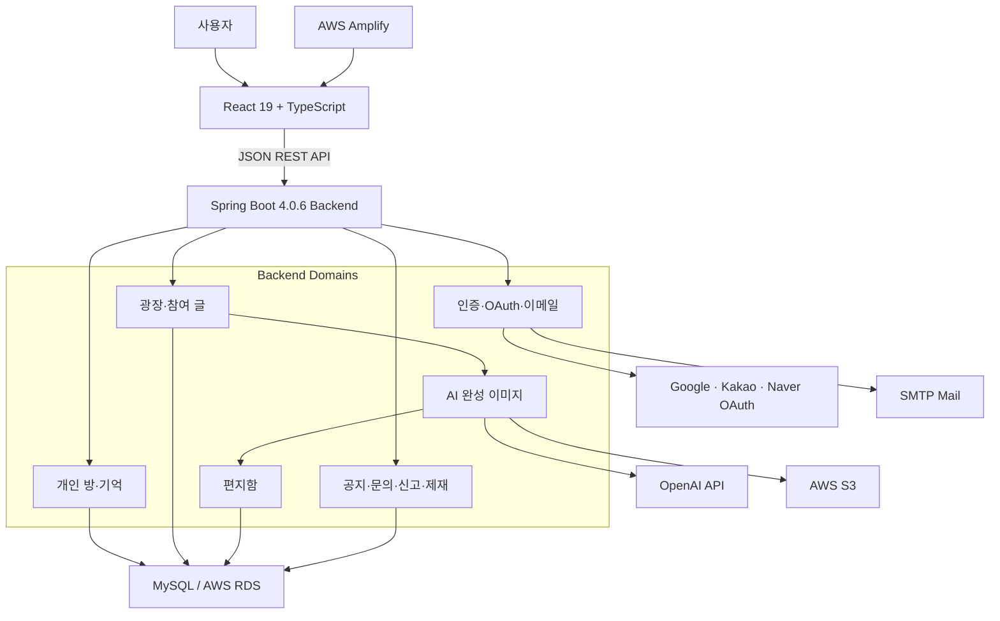
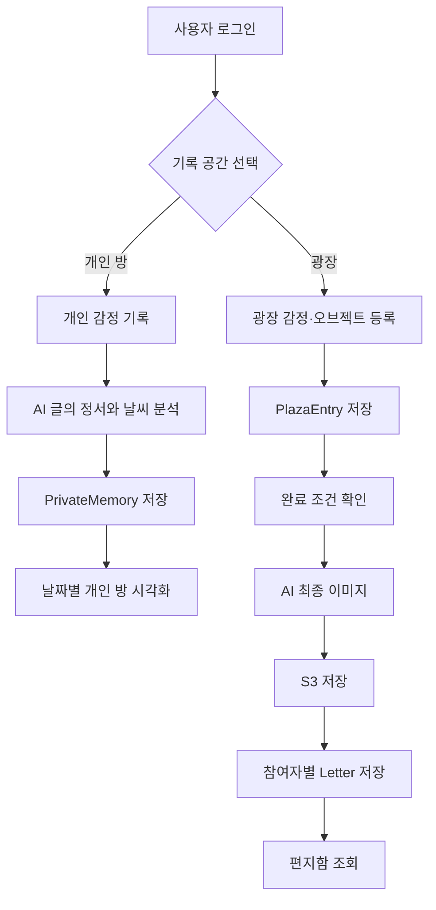
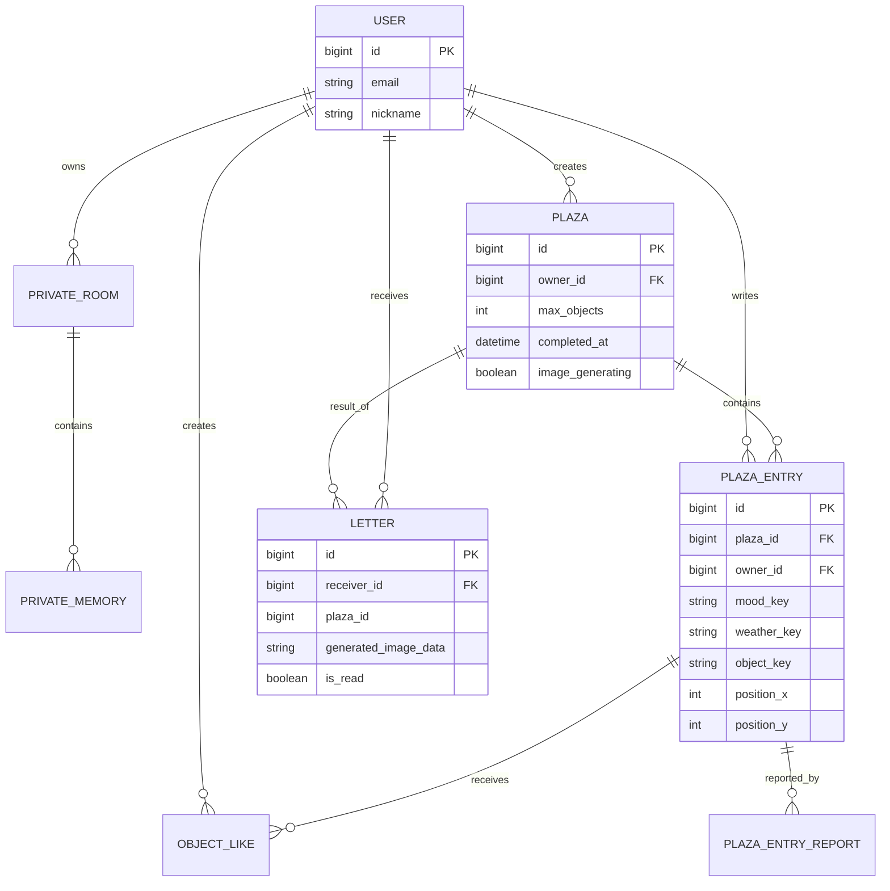
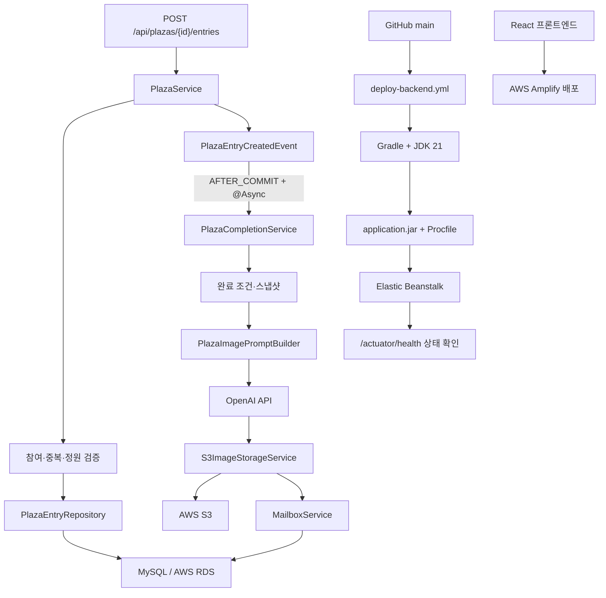
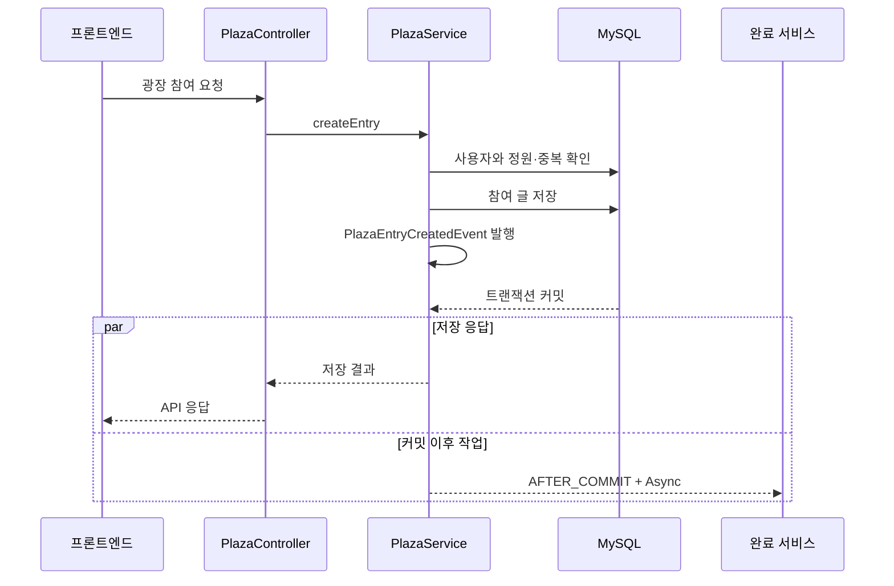
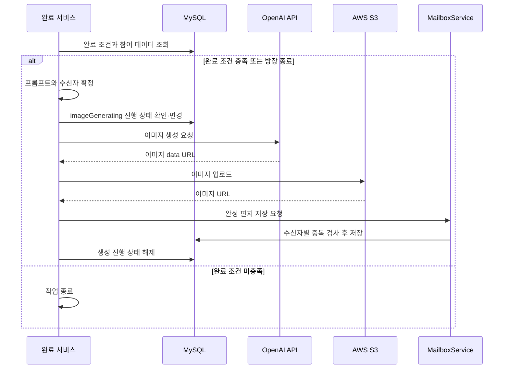
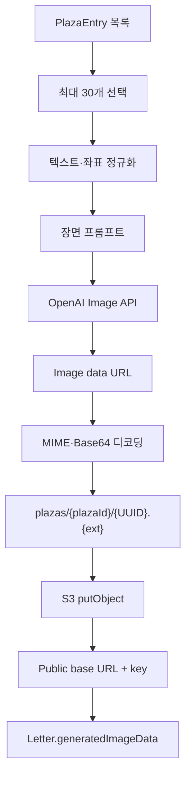
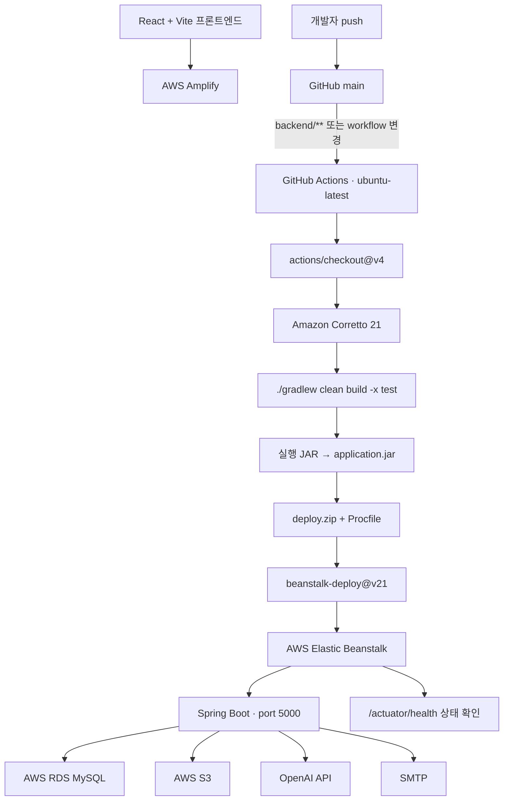
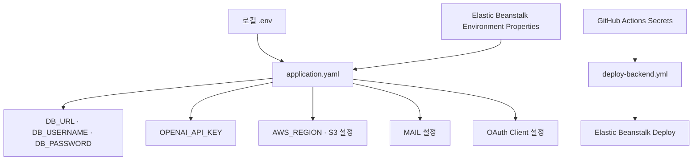

# 시스템 및 배포 구조

이 문서는 `마음의 날씨`의 전체 시스템과 김준영 담당 영역, 광장 완료 처리와 AWS 백엔드·프론트엔드 배포 흐름을 분리해 설명합니다.

- 원본 저장소: [guddlrdl123/WeatherOfTheHeart-](https://github.com/guddlrdl123/WeatherOfTheHeart-)
- 전체 데이터 모델: [원본 저장소 DB ERD](https://github.com/guddlrdl123/WeatherOfTheHeart-/blob/main/docs/db-erd.md)
- 기술 설정 재확인: 2026년 10월 1일, 원본 `main` 커밋 [`40a127e`](https://github.com/guddlrdl123/WeatherOfTheHeart-/commit/40a127ecd8baf8b110a438e9ef1a858a0bf6e77b)
- 실행 안내: [로컬 실행과 AWS 배포](RUN_GUIDE.md) · [이번 점검 근거](README_AUDIT.md)
- 프로젝트 형태: 4인 팀 프로젝트
- 김준영 담당: Java 백엔드, 광장 완료·AI 이미지 흐름, S3 저장, GitHub Actions·YAML·환경변수 구성, Elastic Beanstalk 백엔드 배포, AWS Amplify 프론트엔드 배포

## 1. 전체 시스템 구조

### 구성 요소

| 계층 | 기술 | 역할 |
| --- | --- | --- |
| Client | React, TypeScript, Vite | 화면 렌더링, 사용자 입력, 오브젝트 배치와 API 호출 |
| API | Java 21, Spring Boot, Spring Web MVC | REST API, 인증과 도메인 로직 |
| Persistence | Spring Data JPA, MySQL | 사용자·기억·광장·편지·운영 데이터 저장 |
| AI | WebClient, OpenAI API | 글의 정서에 맞는 날씨 분석과 광장 이미지 생성. LangChain4j starter는 의존성 선언 |
| Object storage | AWS SDK for Java, S3 | AI 결과와 서비스 이미지 저장 |
| Infrastructure | Elastic Beanstalk, Amplify, RDS | 백엔드·프론트엔드 운영 환경과 운영 DB |
| Delivery | GitHub Actions, Gradle, Procfile | 백엔드 자동 빌드, 패키징과 배포 |

## 2. 사용자 공간과 데이터 흐름

개인 방은 월별로 생성되어 기록을 날짜별로 보존하고, 광장은 여러 참여자의 데이터를 하나의 결과 이미지로 결합합니다. 개인 기억 생성 시 AI가 결정하는 값은 날씨이며, 감정 태그와 오브젝트는 사용자 선택값을 저장합니다.

## 3. 주요 도메인 관계

`Letter.plazaId`와 오브젝트 키 일부는 코드상 논리 참조이며 모든 관계가 DB 외래 키로 직접 매핑된 것은 아닙니다.

## 4. 김준영 담당 구조

### 담당 경계

| 포함 | 제외 또는 팀 전체 |
| --- | --- |
| 광장 참여 데이터의 백엔드 기반 | React 화면과 사용자 상호작용 구현 |
| 완료 조건·커밋 이후 이벤트 | 인증·개인 방·관리자 기능 전체를 단독 구현했다는 표현 |
| AI 이미지 프롬프트와 완료 생성 흐름 | 다른 팀원 명의의 후속 통합 커밋을 개인 커밋으로 귀속 |
| S3 이미지 저장과 URL 연결 | 현재 AWS 리소스가 계속 운영 중이라는 표현 |
| GitHub Actions·YAML·환경변수 구성 | 서비스 전체를 혼자 설계·개발했다는 표현 |
| Elastic Beanstalk 배포와 헬스 체크 | 수상 결과를 개인 단독 수상으로 표현 |
| AWS Amplify 프론트엔드 배포(사용자 제공 정보) | Amplify 자동화 세부 방식이 저장소에서 확인된다는 표현 |

## 5. 광장 참여 요청 시퀀스

이벤트는 트랜잭션 안에서 발행되지만 완료 리스너가 `AFTER_COMMIT` 단계에 연결돼, AI 작업은 DB 커밋 이후 시작합니다.

## 6. 광장 완료 시퀀스

### 완료 조건

- 자동 완료: `entries.size() >= plaza.maxObjects`
- 방장 완료: `forceComplete = true`
- 엔티티 기본 정원: 8
- 이미지 프롬프트 입력 상한: 30개
- 중복 실행 제어: `imageGenerating`
- 중복 편지 제어: `receiverId + plazaId` 존재 검사

## 7. AI 이미지 처리 구조

### 실패 경계

- AI 생성 실패 시 예외를 완료 서비스가 잡고 이미지 없는 편지 흐름을 허용합니다.
- S3 업로드 실패 시 원본 data URL을 편지 데이터에 전달하는 폴백이 있습니다.
- 이미지 생성 잠금은 `finally`에서 해제됩니다.
- 편지 저장은 `REQUIRES_NEW` 트랜잭션에서 수신자별 중복을 검사합니다.

## 8. 배포 구조

### 워크플로 설정

| 설정 | 값 |
| --- | --- |
| 트리거 | `push` to `main`, `workflow_dispatch` |
| 경로 필터 | `backend/**`, `.github/workflows/**` |
| Java | 21, Corretto |
| 빌드 | `./gradlew clean build -x test` |
| 배포 파일 | `application.jar`, `Procfile`, `deploy.zip` |
| 버전 라벨 | GitHub run ID와 run attempt 조합 |
| AWS 인증 | GitHub Secrets |

프론트엔드는 AWS Amplify에 배포했으며 기존 담당 기록상 김준영 담당입니다. 현재 Vite 소스의 재현 기준은 `appRoot: frontend`, `npm ci`, `npm run build`, 산출물 `dist`입니다. 원본 저장소에 당시 콘솔 설정 파일이 없으므로 재현용 예시는 [실행 안내](RUN_GUIDE.md)에서 따로 제시합니다. 백엔드는 [2026년 7월 1일 Actions 실행](https://github.com/guddlrdl123/WeatherOfTheHeart-/actions/runs/28488782913)에서 빌드와 Elastic Beanstalk 배포 단계의 성공을 확인했습니다.

## 9. 설정과 환경변수 경계

GitHub Actions, `application.yaml`을 포함한 YAML, 환경변수 구성은 김준영 담당입니다. 설정 파일은 값을 저장하지 않고 실행 환경이 주입할 이름과 기본 동작을 정의합니다.

### 공개 문서에 포함하지 않는 값

- AWS Access Key와 Secret Key
- AWS 계정 번호와 내부 리소스 식별자
- 실제 RDS 호스트·사용자·비밀번호
- 실제 OpenAI API 키
- SMTP 앱 비밀번호
- OAuth Client Secret
- 개인정보가 포함된 허용 URL 또는 운영 로그

## 10. 헬스 체크와 관측

| 엔드포인트 | 응답 | 의미 |
| --- | --- | --- |
| `GET /actuator/health` | 정상일 때 `{"status":"UP"}` | Actuator가 자동 등록한 DB·메일 등의 상태를 종합. 실제 응답은 실행 환경에서 확인 |
| `GET /health` | `200 OK`, `OK` | 컨트롤러가 반환하는 고정 HTTP 응답 |
| `GET /` | `200 OK`, `OK` | 같은 컨트롤러의 루트 응답 |

현재 실행 안내는 `/actuator/health`를 우선 확인하고, `/health`와 `/`를 단순 응답 확인용으로 구분합니다. `application.yaml`에는 Actuator 기본 경로를 바꾸는 설정이 없습니다. OpenAI·S3나 전체 기능의 정상 여부는 기본 Actuator 응답만으로 보장되지 않으며, 실제 로드밸런서에 등록된 경로는 AWS 콘솔 설정에서 확인해야 합니다.

## 11. 운영 상태와 확인된 한계

- 프로젝트 종료 후 유지 비용 절감을 위해 AWS 배포 리소스를 정리해 데모 운영 종료로 표시합니다. 이번 점검에서 현재 AWS 리소스를 재기동하지 않았습니다.
- RDS 보안 그룹, IAM 정책과 Elastic Beanstalk 환경 속성 자체는 저장소에 포함되지 않으므로 코드의 환경변수 참조와 사용자 제공 정보를 기준으로 설명했습니다.
- 전체 Git 이력에는 Amplify 설정 파일과 배포 워크플로가 없어 사용자 제공 담당 정보를 기준으로 설명했습니다.
- `MAIN`, `SUPPORTING` 오브젝트 역할 구분은 현재 코드에 없어 구조도에 넣지 않았습니다.
- 관리자 신고·경고·정지 기능은 프로젝트 전체 구조에 포함하지만 김준영의 직접 구현 영역으로 표시하지 않았습니다.
- 백엔드 테스트 파일은 컨텍스트 로드와 인증 회귀 테스트 각 1건이며, 배포 워크플로는 테스트를 제외하므로 자동 검증 범위가 좁습니다.
- `@Async` 완료 처리는 애플리케이션 프로세스 안에서 실행됩니다. OpenAI HTTP 요청은 연결 오류·시간 초과·429·5xx에 조건부 재시도하지만, 완료 작업을 보존하고 서버 재시작 후 이어가는 영속 큐·자동 복구는 구현되어 있지 않습니다.
- `imageGenerating` 상태 확인은 생성 중 추가 작업을 제한하는 장치이며 원자적 DB 잠금은 아닙니다.
- S3 결과 URL은 공개 기준 URL을 조합하는 방식이므로, 민감한 결과 이미지에는 비공개 버킷과 서명 URL 방식이 더 적합합니다.
- 우수상 증빙은 추가됐고, 실제 서비스 화면과 시연 영상은 개인정보 확인 후 [images 안내](../images/README.md)에 따라 추가해야 합니다.

